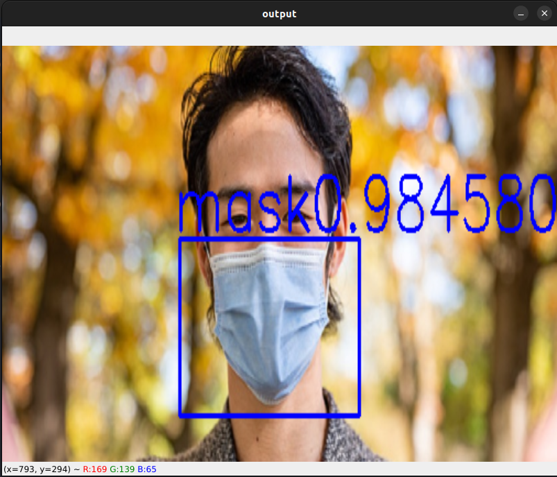

# Mask Detection System

## YOLO v3 Mask Detection

This is a small project on mask detection using yolo_v3. This project was carried out by scraping the photos of people wearing mask in the internet and those photos were labeled using labelImg and a yolo_v3 model was trained on google colab.

## Features

- Identify masks from photo
- Identify masks in live webcam videos.

## Running it locally

```
# Install the dependencies
pip install -r requirements.txt

# Zip the dataset
Zip with corresponding .txt file in images.zip and upload to drive.

# Train the model
*  Run YoloV3_Training.ipynb in google colab for model training.
*  After completion of training yolov3_training.weights should be downloaded from drive.

# Detect in live video
python detect_mask.py

# Detect in live video
python detect_mask_photo.py
```

## Outputs

**1. From photo**



**2. From live video**


